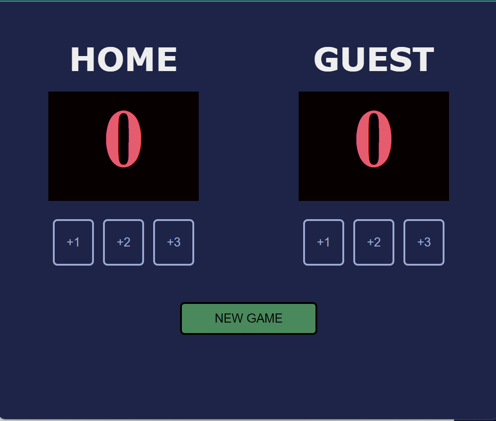
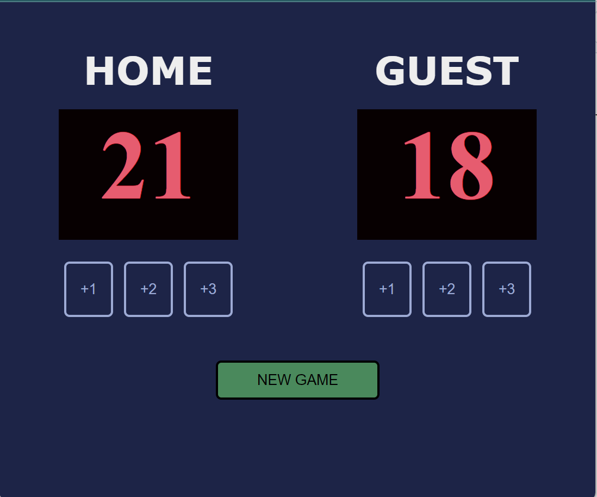

# BasketBall ScoreCard using HTML, CSS and JS

In this project, I have aimed to create a ScoreCard which tracks the scores of 2 teams, The Home Team and The Guest Team, using basic HTML, CSS and JS. This project involves use of interesting CSS styling, use of flex display and DOM Manipulation using JS.

### The features of the ScoreCard are: 
1. It displays the score of both the teams.
1. The scores of each team can be incremented by 1, 2 or 3 at a time.
1. The score of both the teams can be reset to 0 for a new game.

## Sample Outputs

